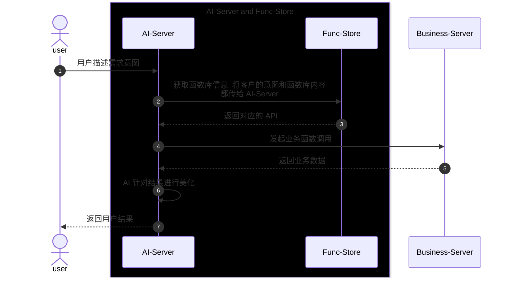

## ChatClient

模拟一个函数调用

```mermaid
sequenceDiagram
    autonumber
    actor user

    box black AI-Server and Func-Store
    participant AI-Server
    participant Func-Store
    end

    participant Business-Server

    user ->> AI-Server: 用户描述需求意图
    AI-Server ->> Func-Store: 获取函数库信息, 将客户的意图和函数库内容 <br/> 都传给 AI-Server
    Func-Store -->> AI-Server: 返回对应的 API


    AI-Server ->> Business-Server: 发起业务函数调用
    Business-Server -->> AI-Server: 返回业务数据
    
    AI-Server ->> AI-Server: AI 针对结果进行美化 

    AI-Server -->> user: 返回用户结果
```

### Question:

* Srping-ai 是怎么将 `String` 的内容转换成 `Entity` 的。